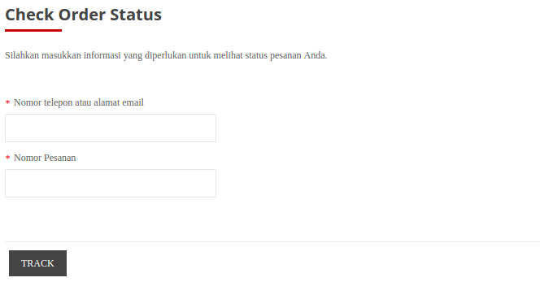
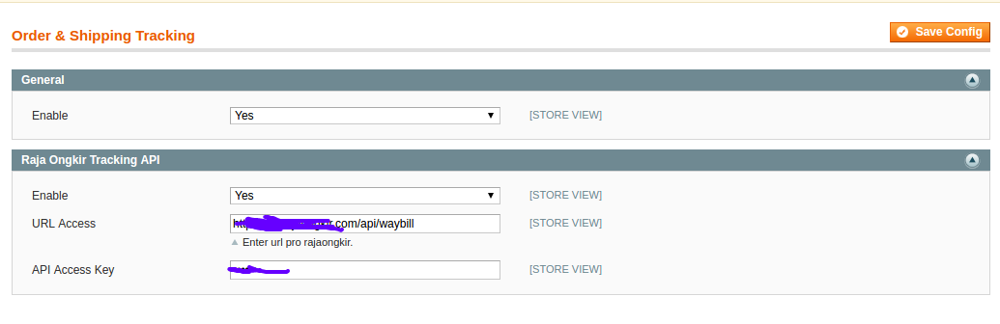
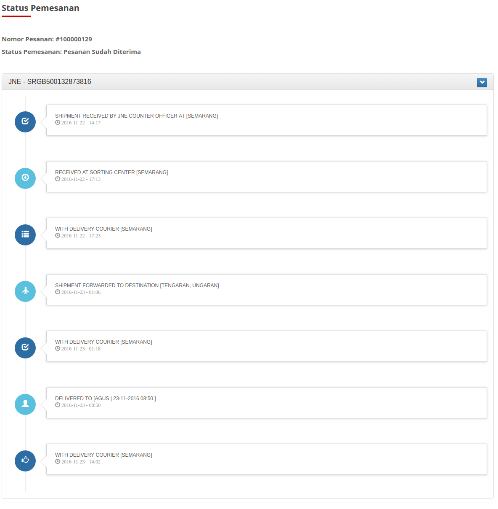

Description
-----------

Order Status & Shipping Tracking.

Admin, Guests & logged-in users can check order status

This extension based on Magento Connect (https://www.magentocommerce.com/magento-connect/),
I

Add CSS
-------------
Please add css in directory src/timeline.css to your magento store for awesome timeline.

Magento Compatibility
-------------

- I'am Make In Community 1.9.x

Order Status & Shipping Tracking Extension Features
-------------

- Guests and registered users can check their order status by entering order number and email or phone

- Magento Rajaongkir integration, Please Upgrade To PRO Raja Ongkir Api Key (http://rajaongkir.com/dokumentasi/pro)

- Admin can enter JNE, TIKI, POS and anymore tracking codes while marking magento order as shipped. These tracking codes will be automatically picked up by this free magento order tracking extension
- 100% open code free magento extension

Screenshots
----------

Access By Guest
-----------
http://127.0.0.1/magento/lacakpesanan/

Extension Configuration
----------

Order Status & Shipping Tracking
----------

Donations
---------- 
*  No. rekening : 302501024583538  a.n Moh. Tobiin (BANK BRI)
